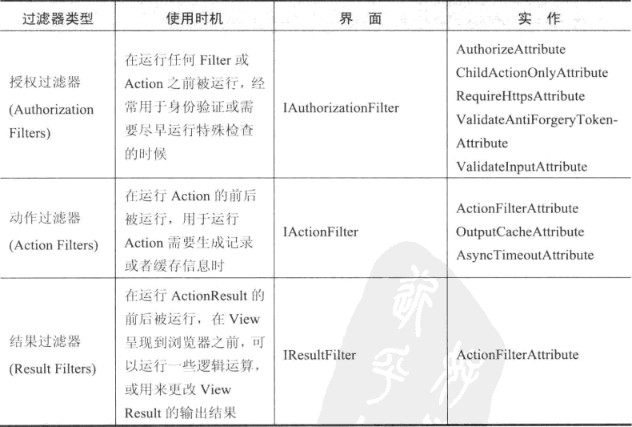
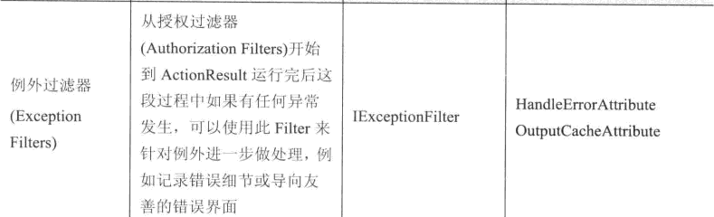
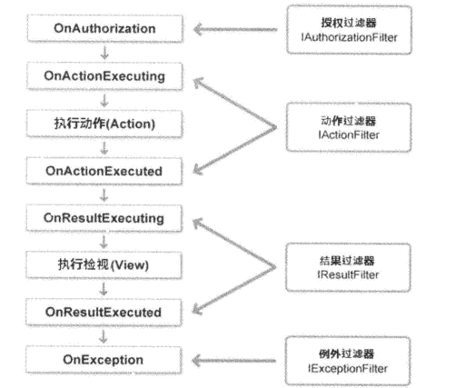

## Controller

### 一、传值

#### 1、ViewData

ViewData相当于是一个字典类型,所以用起来也非常方便:

```
--Controller中申明
 public ActionResult Index()
 {
	ViewData["AAA"]="aaa";
    ViewData["BBB"]="bbb";
    return View();
 }

--View中获取
<h1>@ViewData["AAA"]</h1>
<a>@ViewData["BBB"]</a>
```

但是这种传值方式只会在当前的http请求中生效

#### 2、ViewData.Model

ViewData另外的一种传值方式就是用ViewData.Model,这种方式又分强类型与弱类型

```
--定义一个类
public class UserModel
{
	public string Name { get; set; }

	public int Age { get; set; }
}
 
 --Controll返回一个Model
  public ActionResult Index()
  {
     ViewData.Model = new UserModel{ Name = "张三", Age = 18 };
     return View();
  }
    
```

这个时候View是可以直接获取到这个Model的

```
<h1>@Model.Name 今年@Model.Age 岁了</h1>
```

但是在实际输入的时候,@Model. 后面是没有语法智能提示的(无法直接 **.** 

出Name、Age属性)。想要实现智能提示的话可以通过下面2中方式

##### 1、引用类所在的名称空间,并且强制转换数据类型

```
@using ControllerView.Controllers

@{ 
    var data = (UserModel)Model;
    <h1>@data.Name</h1>
}
```

##### 2、声明一个当前视图专属的数据类型

利用@model可以声明一个视图的专属数据类型，声明完后@Model就会把从Controller中取到的数据自动转换成@model所声明的数据类型(注意:@model跟@Model不是同一个东西)

```
@model ControllerView.Controllers.UserModel

@{ 
    if (Model != null)
    {
        <h1>@Model.Name 今年@Model.Age 岁了</h1>
    }
}
```


#### 3、ViewBag

声明ViewBag后实际上还是会被转换成VIewData来执行，唯一的区别在于ViewBag是dynamic类型,所以可以直接写任何的属性。

```
--ViewDaTa的写法
ViewDaTa["Message"]="你好";

--ViewBag的写法
ViewBag.Message="你好";

--View调用ViewBag
<h1>@ViewBag.Message</h1>

```


#### 4、TempData

TempData也是字典类型,同ViewData一样的用法，但是TempData保存数据的有效期不是一定的,一般来说Controller使用RedirectResult或者RedirectToRouteResult类型的话 是可以强制保留TempData的数据，如果不用的话，数据的有效期取决于“何时被调用”,TempData是用Session来保存的。在当前的mvc生命周期结束之前，mvc回去查看TempData是否被读取过,如果被读取过就删除该变量。来做几个测试:

声明一个TempData变量，然后在下一个Action中获取该变量

```
public ActionResult Index()
 {
   	TempData["User"] = "张三";
  	return View();
  }
  
  public ActionResult Test()
  {
     var data = TempData["User"];
     return View("Index");
  }
```

浏览器输入输入/home/index  后再次输入 /home/test  会发现在Test 的Action中可以获取到TempData["User"]这个变量


声明一个TempData变量，然后想着再下一个Action中获取该变量,但是在Index的对应的视图中 显示了这个TempData变量

```
public ActionResult Index()
{
  	TempData["User"] = "张三";
	return View();
}

public ActionResult Test()
{
	var data = TempData["User"];
	return View("Index");
}

-------------Index视图中-----------------
<h1>来至于TempData的数据 @TempData["User"]</h1>
```

在浏览器中输入/home/index 页面中会显示"来至于TempData的数据 张三",

再次输入/home/test 在Test的Action中会发现TempData["User"]这个变量为null。

同样的道理还有,在Index的Action中声明TempData后，马上获取这个变量。然后在Test的Action中也是无法获取到TempData变量的


利用RedirectResult 作为Action的返回类型,在Index中定义了TempData["User"]变量后接着用data变量接受了TempData["User"]，然后跳转到NewIndex，按照前面的逻辑此时在NewIndex里面 了TempData["User"]应该会null才对。实际上它确实有值的，这也应征了使用RedirectResult或者RedirectToRouteResult类型的话 是可以强制保留TempData的数据

```
public ActionResult Index()
{
  	TempData["User"] = "张三";
  	var data = TempData["User"];
	return Redirect("/home/newindex");
}
public ActionResult NewIndex()
{
	var data = TempData["User"];
	return View("Index");
}
```


##### 小结一下

使用RedirectResult或者RedirectToRouteResult类型的话 是可以强制保留TempData的数据.如果没有的话，TempData变量会保存到下一次被读取的时候！这样的话empData就可以当做Action之间来传递数据了


### 二、模型绑定

#### 1、简单的模型绑定

在View中，写一个post提交的表单,并且加入判断：如果@Model不为空的话,显示@Model的数据

```
--View代码
@using (Html.BeginForm("index", "home", FormMethod.Post))
{
    @Html.TextBox("name");
    <input type="submit" value="提交" />
    if (Model != null)
    {
        <h1>来至于Controller的数据:Model</h1>
    }
}
```

然后定义两个Index的Action 分别相应Get、Post请求

```
[HttpGet]
public ActionResult Index()
{
	return View();
}

[HttpPost]
public ActionResult Index(string name)
{
	ViewData.Model = name;
	return View();
}
```

浏览器中输入/home/index  相应的是get请求,查看页面中的html:

```
<form action="/" method="post">
	<input name="name" id="name" type="text" value="">  
    <input type="submit" value="提交">
</form>
```

然后文本框中随便输入数据后，点击"提交按钮"，这个时候表单会被post提交，此时在相应Post请求的Index方法中,可以获取到这个name数据

假如说在表单中新增一个name=age 的input,那么post提交以后 name数据会是哪儿呢？实际操作后发现Index方法的参数name 对应的还是name="name"的这个input，及时调换了age跟name 这两个input的顺序也不影响取值，这样就可以得出结论:mvc提交表单的时候,参数默认会绑定到表单中同名的数据！所以在Index方法中也新增一个age的参数，这样就可以同时获取到表单中的name跟age了。这样做是可以的，但是如果说表单的数据很多呢？不可能一个个的参数都写出来吧？

#### 2、绑定表单

修改post方法

```
[HttpPost]
public ActionResult Index(FormCollection from)
{
	ViewData.Model = from["name"];
	return View();
}
```

用FormCollection 类型来接受表单中的数据，这个对象会根据表单中的name属性，一一对应的创建一个数据集合


#### 3、绑定复杂对象

```
--定义一个对象
public class UserModel
{
	public string Name { get; set; }
	public int Age { get; set; }
}

--修改post请求的方法
[HttpPost]
public ActionResult Index(UserModel model)
{
	ViewData.Model = model.Name;
	return View();
}
```

这种方式跟前面绑定表单相识，都是根据相同名字来反序列话数据

#### 4、多个复杂对象

修改View,注意input的name属性 是由对象名称.属性的方式来命名的

```
@using (Html.BeginForm("index", "home", FormMethod.Post))
{
    @Html.TextBox("model1.age");
    @Html.TextBox("model1.name");

    @Html.TextBox("model2.age");
    @Html.TextBox("model2.name");
    <input type="submit" value="提交" />
    if (Model != null)
    {
        <h1>来至于Controller的数据: @Model</h1>
    }
}
```

修改index方法,注意:参数名称要跟viw里面定义的名称一致,即view里model1.name的这个model1 必须要跟接受的参数 名称一致，这样才可以反序列化到对象。如果名称不一样就绑定不了数据

```
 [HttpPost]
 public ActionResult Index(UserModel model1,UserModel model2)
 {
 	ViewData.Model = model1.Name;
 	return View();
 }
```


#### 5、数据验证

修改view 如果验证不通过显示错误信息

```
@using (Html.BeginForm("index", "home", FormMethod.Post))
{
    @Html.TextBox("age");
    @Html.TextBox("name");
    
    <input type="submit" value="提交" />
    if (ViewBag.Message != null)
    {
        <h1>来至于Controller的数据: @ViewBag.Message</h1>
    }
}
```

修改UserModel类,跟Name添加一个不能为空的特性(Required)

```
public class UserModel
{
  	[Required]
  	public string Name { get; set; }
	public int Age { get; set; }
}
```

修改index方法,如果验证不通过，返回错误信息

```
[HttpPost]
public ActionResult Index(UserModel model)
{
  if (ModelState.IsValid)
  {
  	ViewBag.Message = model.Name;
  }
  else
  {
  	ViewBag.Message = "验证不通过";
  }
	return View();
}
```


在定义模型的时候,也可以把详细的验证错误信息直接写到Model对象上面

```
 public class UserModel
 {
 	[Required(ErrorMessage ="用户名不能为空")]
 	public string Name { get; set; }

	[Range(18,30,ErrorMessage = "年龄必须在18-30岁之间")]
	[RegularExpression(@"\d",ErrorMessage ="年龄必须是数字")]
	public int Age { get; set; }
}
```

然后修改index方法

```
[HttpPost]
public ActionResult Index(UserModel model)
{
    if (ModelState.IsValid)
    {
    	ViewBag.Message = model.Name;
    }
    else
    {
    	if (ModelState["Name"].Errors.Count > 0)
    	{
    		ModelError erroe = ModelState["Name"].Errors[0];
    		ViewBag.Message = erroe.ErrorMessage;
    	}
      if (ModelState["Age"].Errors.Count > 0)
      {
        ModelError erroe = ModelState["Age"].Errors[0];
        ViewBag.Message = erroe.ErrorMessage;
      }
    }
	return View();
}
```

ModelState对象可以根据指定的对象属性去判断具体的验证错误信息,然后把信息返回给view。

除了在model里面把验证信息写死掉，还可以通过ModelState.AddModelError来自定义错误信

```
ModelState.AddModelError("Name", "名字重复了");
```


#### 6、绑定特定的字段

假设一个对象有很多地方都被重用,而当前的Action只需要绑定其中的部分字段的话,怎么办？这个时候就可以在Action的参数 前面加上bind特性了

```
 public ActionResult Index([Bind(Exclude ="Age")]UserModel model)
 {
  	return View();
}
```

Bind类有3个属性，

##### Exclude:获取或设置不允许绑定的属性名称的列表（各属性名称之间用逗号分隔）。

##### Include：获取或设置允许绑定的属性名称的列表（各属性名称之间用逗号分隔）。

##### Prefix： 获取或设置在呈现表示绑定到操作参数或模型属性的标记时要使用的前缀。

如果不想再每一个Action的参数前面加Bind，那也可以直接在类上面加

```
[Bind(Exclude = "Age")]
public class UserModel
{
  //属性
}
```


因为排除了一下字段的绑定,而模型里面又写了该字段的验证的话,那么这个验证必然是不会通过的,所以可以用TryUpdateModel来尝试绑定模型,

```
 public ActionResult Index(FormCollection form)
 {
     UserModel model = new UserModel();
     if (!TryUpdateModel<UserModel>(model))
     {
    	 ViewBag.Message = "绑定失败";
     	return View();
     }
 }
```


### 三、过滤






通过上图可以看出过滤器的执行顺序为:



