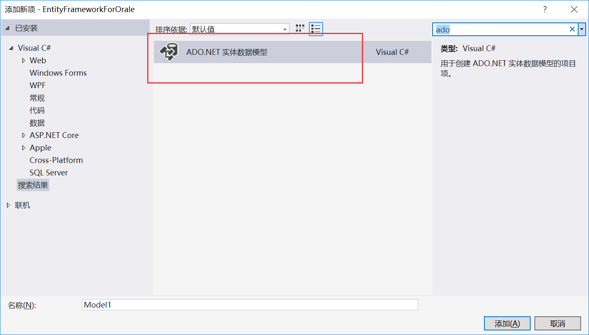
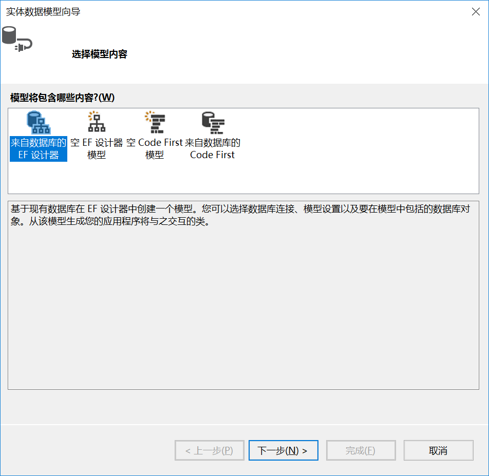
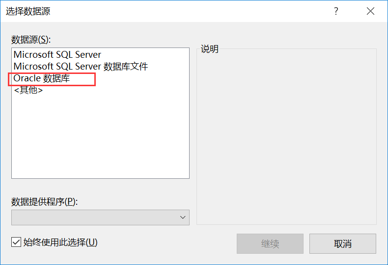
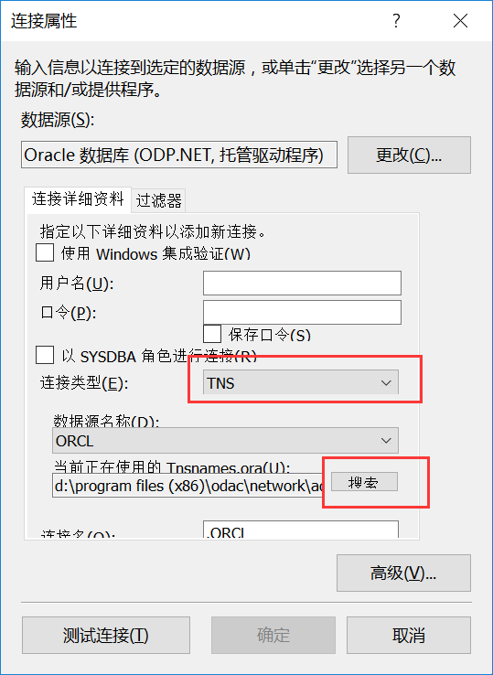
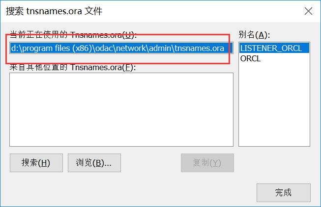
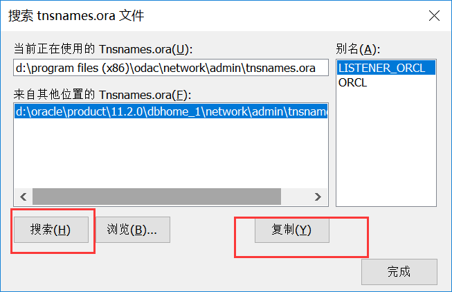

## EntityFramework 链接oralc

### 一、新建项目

随便创建一个项目，在NuGet中搜索“ManagedDataAccess”

同样的安装Entity FrameWorl

然后取oracle 官网下载一个oracle的驱动器：

> <http://www.oracle.com/technetwork/topics/dotnet/downloads/index.html>

安装完成后重启VS

###  二、新建链接

**注意：如果没有安装oracle 驱动器的话，那么这里置灰显示前面两个，没有oralce的选项**

这里配置的时候**链接类型** 必须选择**TNS**

然后点击搜索

默认加载的地址是之前oracle 驱动(odbc)的安装路径，它默认配置的tns是没用的，所以需要搜索一下电脑里面oracle 客户端的链接配置，并且把这个配置复制到odbc文件夹夏敏

然后，弹出的警告框大意是说要把odbc下面的 tns配置文件替换为 oracl客户端的tns文件，反正点击确定就行了

测试链接OK！！！

