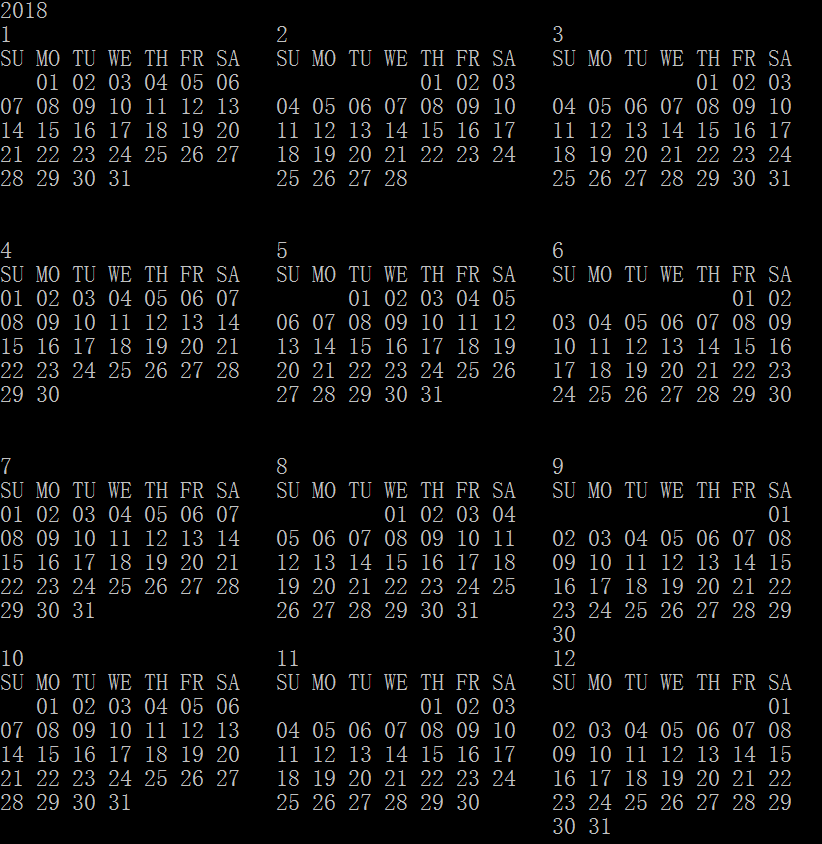

## Linq中一些好用的技巧

#### 一、随机排序(洗牌)

```
int[] arr = { 1, 2, 3, 4, 5, 6, 7, 8, 9, 10 };
var query = arr.OrderBy(x => Guid.NewGuid());
foreach (int i in query)
{
    Console.Write(i + " ");
}
```

根据guid来排序，所以每次生成的结果都不同，如果从M个数字中取出N个来生成随机排序，只需要在最后加一个Take(N)即可

```
 var query = arr.OrderBy(x => Guid.NewGuid()).Take(5);
```


#### 二、生成排列组合

假设有个一个数组[1,2,3,4] 现在要取得这个数组中4个数字 任意排列组合

```
int[] arr = { 1, 2, 3, 4 };
IEnumerable<IEnumerable<int>> result = arr.Select(x => new List<int>() { x });
for (int i = 1; i < arr.Length; i++)
	result = result.SelectMany(x => arr.Except(x), (x, y) => x.Concat(new int[] { y }));
foreach (var item in result)
{
	foreach (int i in item)
	Console.Write(i + " ");
	Console.WriteLine();
}
```

执行结果是:

```
1 2 3 4
1 2 4 3
1 3 2 4
1 3 4 2
1 4 2 3
1 4 3 2
2 1 3 4
2 1 4 3
2 3 1 4
2 3 4 1
2 4 1 3
2 4 3 1
3 1 2 4
3 1 4 2
3 2 1 4
3 2 4 1
3 4 1 2
3 4 2 1
4 1 2 3
4 1 3 2
4 2 1 3
4 2 3 1
4 3 1 2
4 3 2 1
```

还是同一个数组[1,2,3,4]

获取任意多个数字组合不重复

```
 static IEnumerable<IEnumerable<int>> SelectNElements(int[] arr, int n)
 {
 	IEnumerable<IEnumerable<int>> result = arr.Select(x => new List<int>() { x });
 	for (int i = 1; i < n; i++)
 		result = result.SelectMany(x => arr.Where(y => y > x.Max()), (x, y) => x.Concat(new 		int[] { y }));
    return result;
 }

static void Main(string[] args)
{

    int[] arr = { 1, 2, 3, 4 };
    for (int i = 1; i <= arr.Length; i++)
    {
    	var result = SelectNElements(arr, i);
    	foreach (var item in result)
    	{
    		foreach (int x in item)
    			Console.Write(x + " ");
    		Console.WriteLine();
    	}
    }

	Console.ReadKey();
}
```


#### 三、生成年历

```
 static void Main(string[] args)
        {

            string calendar = "";
            calendar = (from x in Enumerable.Range(1, 12)
                        group x by (x + 2) / 3 into g
                        select (BuildCalendar(DateTime.Now.Year, g.ToList()[0]).Split(new char[] { '\r', '\n' }, StringSplitOptions.RemoveEmptyEntries).Union(new string[] { "\r\n" })
                              .Zip(BuildCalendar(DateTime.Now.Year, g.ToList()[1]).Split(new char[] { '\r', '\n' }, StringSplitOptions.RemoveEmptyEntries).Union(new string[] { "\r\n" }), (x, y) => x.TrimEnd().PadRight(23, ' ') + y)
                              .Zip(BuildCalendar(DateTime.Now.Year, g.ToList()[2]).Split(new char[] { '\r', '\n' }, StringSplitOptions.RemoveEmptyEntries).Union(new string[] { "\r\n" }), (x, y) => x.TrimEnd().PadRight(46, ' ') + y))
                              .Zip(Enumerable.Repeat("\r\n", 8), (x, y) => x + y)
                              .Aggregate((serials, current) => serials + current))
                         .Aggregate((serials, current) => serials + current);
            Console.WriteLine(DateTime.Now.Year + "\r\n" + calendar);

            Console.ReadKey();

        }

        static string BuildCalendar(int year, int month)
        {
            string calendar = new string[] { month.ToString(), "SU MO TU WE TH FR SA" }
                .Union(Enumerable.Range(
                    1 - (int)new DateTime(year, month, 1).DayOfWeek,
                    new DateTime(year, month, 1).AddMonths(1).AddDays(-1).Day + (int)new DateTime(year, month, 1).DayOfWeek
                )
                .GroupBy(x => ((x + (int)(new DateTime(year, month, 1).DayOfWeek + 6)) / 7), (key, g) => new { GroupKey = key, Items = g })
                .Select(x =>
                    x.Items.Select(y => y < 1 ? "   " : Convert.ToString(y).PadLeft(2, '0') + " ")
                           .Aggregate((serials, current) => serials + current))
                )
                .Aggregate((serial, current) => serial + "\r\n" + current);
            return calendar;
        }
```

运行结果:




参考链接:http://gitbook.cn/books/5a41644d75267d3b337142e9/index.html