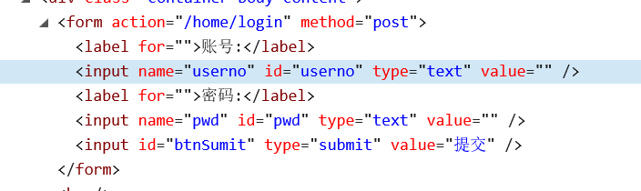
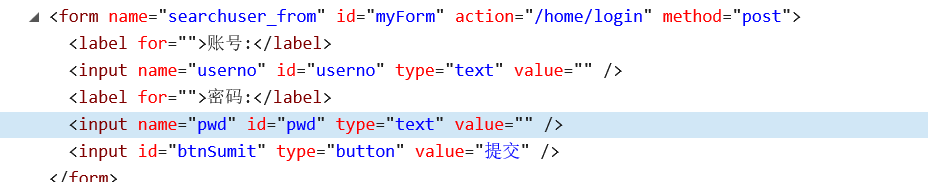
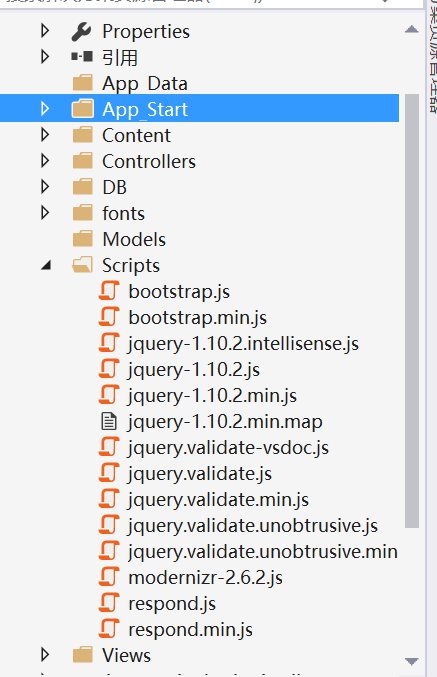
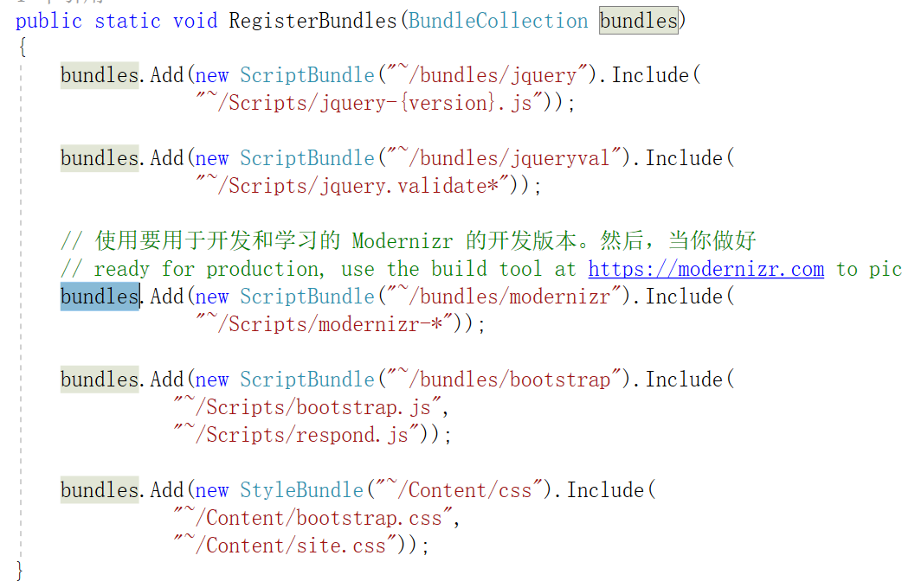
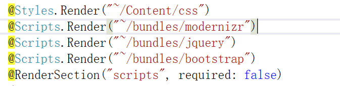

##  Razor视图 一些常用知识点

###  一、通过HtmlHelper快速创建html

 

创建表单

```
@using (Html.BeginForm("login", "home", FormMethod.Post))
{
    @Html.Label("账号:") @Html.TextBox("userno");
    @Html.Label("密码:") @Html.TextBox("pwd");

    <input id="btnSumit" type="submit" value="提交" />
}
```

生成html以后




创建一个带id的表单

```
@using (Html.BeginForm("login", "home", FormMethod.Post, new { id = "myForm",name = "searchuser_from" }))
{
    @Html.Label("账号:") @Html.TextBox("userno");
    @Html.Label("密码:") @Html.TextBox("pwd");

    <input id="btnSumit" type="button" value="提交" />
    @*<input id="btnSumit" type="submit" value="提交" />*@
}
```




其他的元素都可以通过这样的方式来创建


### 二、使用jQuery

创建mvc 项目点 时候，如果使用默认mvc框架来创建项目，那么在项目的文件结构中就包含了jquery的库




在App_star文件夹中的BundleConfig里面，默认就添加了 jquery的引用



然后在布局页面(_LayOut)页面中就把这些静态文件全部加载到页面中去了




之前想着，直接在view里面写脚本

```
<script type="text/javascript">
    $(function () {
        //todo
    });
</script>
```

但是这样就会报$未定义，查看了一下html发现，写的这一点脚本是在 jquery库引用之前！！


后来发现 在_LayOut 页面中 有一句**@RenderSection("scripts", required: false)**

查了一下，原来这个玩意就是给view 写脚本的占位符

所以就改成

```
@section scripts
{
    <script type="text/javascript">
        $(function () {
            $("#btnSumit").on("click", function () {
                $("form").submit();
            })
        });
    </script>
}
```

注意： **section** 是关键字，scripts就是layout页面注册脚本占位符的那个名字，对应起来就行了


###  三、判断语句 以及类型转换

用户登录后，把User对象保存到Session中，然后在页面来判断用户是否登录，从而加载不同的html


```
@*TSYS_USER对象所在的名称空间*@
 
 @{
   var user = (TSYS_USER)System.Web.HttpContext.Current.Session["LoginUser"];
   if (user==null||user.EM_USERNO.Length== 0)
   {
     <li >@Html.ActionLink("登录", "Login", "Home")</li>
   }
   else
   {
      <li >@Html.ActionLink("用户中心", "UserInfo", "Home")</li>
   }
 }
```

这里就是强类型转换var user = (TSYS_USER)System.Web.HttpContext.Current.Session["LoginUser"]，

然后通过判断user对象的属性，来加载不同的html

类似的其他的c# 后端代码，都可以在@{  }里面来写

```
@{ 
  for (int i = 0; i < 10; i++)
  {
	//todo
  }
}
```


