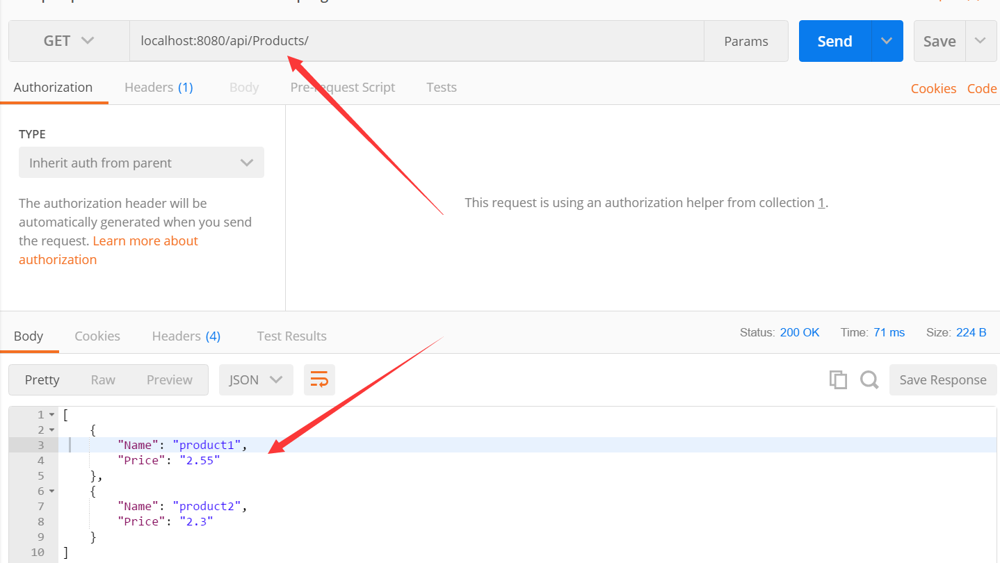

nugut搜索**OwinSelfHost**  选择 **Microsoft.AspNet.WebApi.OwinSelfHost** 安装


添加一个Startup类

```
[assembly: OwinStartup(typeof(SelfHost.Startup))]
namespace SelfHost
{
    public  class Startup
    {
        public void Configuration(IAppBuilder app)
        {
            HttpConfiguration config = new HttpConfiguration();
            config.Routes.MapHttpRoute(name: "DefaultApi",
                routeTemplate: "api/{Controller}/{id}",
                defaults: new
                {
                    id = RouteParameter.Optional
                });

            app.UseWebApi(config);
        }
    }
}
```


添加model类

```
public class Product
    {
        public string Name { get; set; }
        public string Price { get; set; }

    }
```

添加控制器

```
public class ProductsController: ApiController
    {
        static List<Product> products = new List<Product>() {
        new Product(){Name="product1",Price="2.55"},
        new Product(){Name="product2",Price="2.3"}
        };
        public IEnumerable<Product> Get()
        {
            return products;
        }
    }
```


最后在main函数里面启动服务

```
static void Main(string[] args)
        {
            string baseAddress = "http://localhost:8080/";
            using (WebApp.Start<Startup>(url: baseAddress))
            {
                Console.WriteLine("Press Enter to quit.");
                Console.ReadLine();
            }
        }
```


postman测试结果



