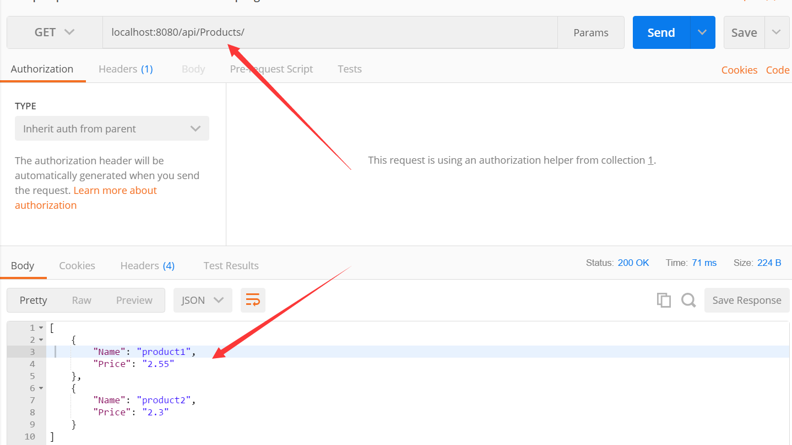

自托管就是，不依赖iis，自成一个服务器，下面就是要用一个控制台程序来完成webapi


nuget搜索**SelfHost**  可以看到 多种语言版本的 **Microsoft.AspNet.WebApi.SelfHost**

选择中文版的**Microsoft.AspNet.WebApi.SelfHost.zh-Hans** 安装即可


创建一个model类

```
public class Product
    {
        public string Name { get; set; }
        public string Price { get; set; }

    }
```


添加一个控制器,并且继承ApiController

```
public class ProductsController: ApiController
    {
        static List<Product> products = new List<Product>() {
        new Product(){Name="product1",Price="2.55"},
        new Product(){Name="product2",Price="2.3"}
        };
        public IEnumerable<Product> Get()
        {
            return products;
        }
    }
```


最主要的是在main函数中

```
static void Main(string[] args)
        {
            var config = new HttpSelfHostConfiguration("http://localhost:8080");

            config.Routes.MapHttpRoute(
                "API Default", "api/{controller}/{id}",
                new { id = RouteParameter.Optional });

            using (HttpSelfHostServer server = new HttpSelfHostServer(config))
            {
                server.OpenAsync().Wait();
                Console.WriteLine("Press Enter to quit.");
                Console.ReadLine();
            }
        }
```


如果是vs直接debug调试的话，需要用管理员模式运行vs才行，如果是直接运行exe，也是需要管理员模式


程序启动后，直接用postman测试



